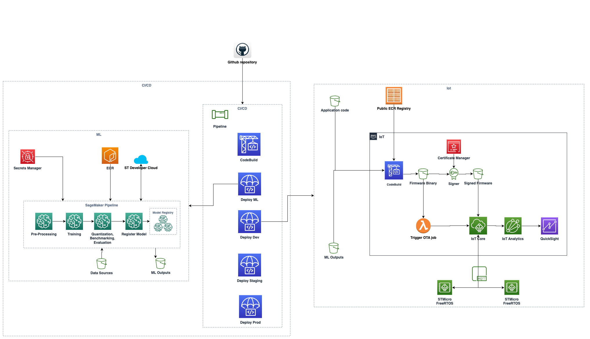
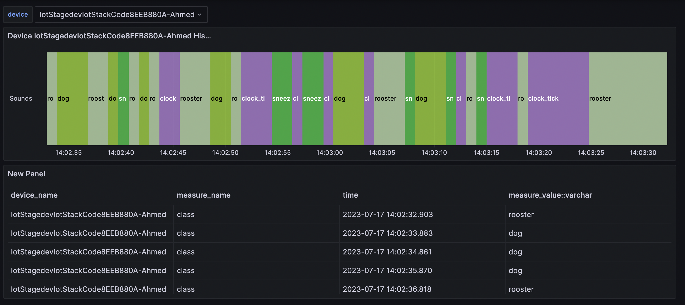

# AWS STM32 ML at Edge Accelerator

This is an AWS STM32 example project that implements MLOps infrastructure using SageMaker pipeline to train and generate an audio classification model that will run on edge devices (stm32u5 series) with OTA updates using Freertos. Devices are connected to Iot Core and data is collected via mqtt.

## Architecture



## Deployment

The project is built using CDK IaC. So it can be deployed to your AWS account with a single deploy command.

**Note**
This Project was only tested on region `eu-west-1`

### Pre-requisites

- Ensure your AWS credentials are in place for your Pipeline account (The account that will host the pipeline stack if different)
- Ensure you have [Node.js](https://nodejs.org) and [Docker](https://www.docker.com/products/docker-desktop/) installed
- Create an account in [STM32Cube.AI Developer Cloud](https://stm32ai-cs.st.com/home)
- In your AWS Account that will host the ML Stack (if different). Go to secrets manager console page:
  1.  Create a new secret for your ST username
      1.  Choose type other
      1.  Choose Plaintext tab
      1.  Overwrite content with you username
      1.  Give this secret the following name `STDEVCLOUD_USERNAME_SECRET` (if you require a different name, then ensure to update this new name in `cdk.json`)
  1.  Create a new secret for your ST password
      1.  Repeat the previous step but with the following secret name `STDEVCLOUD_PASSWORD_SECRET`
          run the following commands
- In your AWS Account that will host the Iot Stack [enable AWS IAM Identity Center and create a user for yourself](https://console.aws.amazon.com/singlesignon/identity/home)
- Bootstrap your account (each account if more than one) with the following command replacing your account and region placeholders
  ```
  npx cdk bootstrap aws://<ACCOUNT-NUMBER>/<REGION> --toolkit-stack-name CDKToolkit-StMicro --qualifier stmicro
  ```

### deploy the CICD Pipeline

1. Fork this repo.
1. Clone your fork locally.
1. Go to [cdk.json](./cdk.json) and put your aws account details for each stack in the `env` field, you could deploy the stacks in the same account or in different accounts
1. You need to set up a connection between the pipeline and your forked Repo
   1. Follow the steps to create & verify the connection [here](https://docs.aws.amazon.com/dtconsole/latest/userguide/connections-create-github.html)
   1. Go to [cdk.json](./cdk.json) and paste your forked Repo name, branch & connection Arn in the config section.
1. In the root folder, run the following commands
   ```
   npm install
   npm run cdk synth
   ```
1. You will notice a `cdk.context.json` is created. Please commit this file along with your edited `cdk.json`. And push the commit to your forked repo.
1. Once your repo has been updated with the `cdk.json` & the newly created `cdk.context.json`, we can finally deploy with
   ```
   npm run deploy
   ```
1. This is the only time you need to run commands locally, for any future changes just push new commits to your repo and the pipeline redeploy the new code changes.

### Setup the Device

These steps assume you have a [B-U585I-IOT02A](https://www.arrow.com/en/products/b-u585i-iot02a/stmicroelectronics) device

#### Pre-requisites

- Ensure your AWS credentials are in place for your IoT account (The account that will host the IoT stack if different)
- Download and Install [STM32CubeProgrammer](https://www.st.com/en/development-tools/stm32cubeprog.html) to be able to flash device with initial firmware

  **Note**
  if installing on a Mac make sure you run the following command before installing to give it exec permission `sudo xattr -cr ~/SetupSTM32CubeProgrammer-macos.app`

#### Provision Your Board

To provision your board follow below steps:

1. Go to stm32 folder

   ```
   cd stm32
   ```

1. Setup your environment

   ```
   sh tools/env_setup.sh
   ```

1. Source your environment

   ```
   source .venv/bin/activate
   ```

1. Plug in the device you want to provision

1. In your AWS Console go to the cloudformation page and then click on IoTStack and view the Output tab. Copy and run the `ProvisionScript` replacing the <> with a unique name for your device, you can keep all default values but you will need to fill the WIFI SSID and Password details. The script should look like below
   ```
   python tools/provision.py --interactive  --thing-name <Thing-Name>
   ```

After you provision the device successfully. Go back to the output tab of the IotStack in cloudformation page. And copy the public key value ( including the public key labels before & after the code )

**Warning**
The displayed public key might not be properly formatted, please ensure you fix the format using any text editor to add the correct newlines as seen below before continuing. Make sure you don't miss the line break that splits the key itself in 2 lines.

```
-----BEGIN PUBLIC KEY-----
MFkwEwYHKoZIzj0CAQYIKoZIzj0DAQcDQgAECSEgXkzVQkq2fQwPjIhKIkvJBVCl
VaRDhiyj9BGkHbuAnGzM0gC+z6oYpxbkgE3qa6fHJoE99QTwrRh8XWwyCg==
-----END PUBLIC KEY-----
```

And follow below steps:

1. Connect to device using `screen /dev/tty.usb* 115200`,
1. Connect to device using `screen <Serial_Port_Filename> 115200`, you need to find and replace the correct serial port file name e.g. `/dev/tty.usbmodem1203`, approach will be different for each platform, but you could try `ls /dev/tty.usb*`
1. Run this command `pki import key ota_signer_pub`
1. Paste the public key you copied. you should see a confirmation of key being registered, if not please make sure you followed and formatted the line breaks correctly as mentioned earlier

## Flashing the device

Before we can use over the air (OTA) firmware updates, we need to atlease flash the device with the firmware manually once. Then future changes will be handled by Freertos OTA updates.

After deployment is successfull a binary firmware file should have been created in s3 bucket. You can find the name of the bucket in the same cloudformation output tab for the iotStack. The binary file will have the follwing name `b_u585i_iot02a_ntz.bin`, please download this file.
If you have already installed [STM32CubeProgrammer](https://www.st.com/en/development-tools/stm32cubeprog.html), follow these steps to flash the device with the firware.

**Note**
if installing on a Mac make sure you run the following command before installing to give it exec permission `sudo xattr -cr ~/SetupSTM32CubeProgrammer-macos.app`

1. Connect your device to your computer
1. Open STM32CubeProgrammer
1. Click Connect button on top right to connect to device
1. Go to Menu and choose `Erase & programming`
1. Click Browse and choose our binary file we just downloaded from s3
1. Click `Start Programming` to flash binary to device
1. When finished click `Disconnect` on top right corner

**Note**
If you face any issue with device, try clicking on `Full chip erase` and re-program

Once flashed if you are still connected to the device using the screen command i.e. `screen /dev/tty.usbmodem103 115200`, you should see the device starting to log sound class detected from sensors.

## Iot

Our device should be publishing MQTT messages now. If you go to AWS IoT console page and open MQTT test client, type the following in the filter `<Device_Name>/mic_sensor_data` and subscribe. You will see the messages coming in from this device.

These messages are streamed and stored into Amazon Timestream. Which will then be used as a datasource for Grafana to visualise it.

## Grafana Dashboard

To see everything in action, we can login to Grafana and checkout our Dashboard.
After deployment the url for our grafana instance will be printed out in your command line or you could get the url from your AWS console by visiting the Managed Grafana service page, however you won't have access yet.
AWS Managed Grafana is using AWS IAM Identity Center for Authorisation previously known as AWS Single Sign-On (SSO).

As mentioned in prequisite you should have an IAM Identity User created by now, if not then please [enable AWS IAM Identity Center and create a user for yourself](https://console.aws.amazon.com/singlesignon/identity/home). Now we need to give your user permission to access our Grafana Instance.

1. Login to your console and visit the Managed Grafana servie page.
1. Go to the grafana workspace created by our deployment.
1. In the Authentication tab, click on `Configure users and user groups`
1. Add your IAM Identity User

Now you are ready to visit grafana dashboard

1. Just visit the grafana url either printed in your terminal or diplayed in your console under Grafana workspace Url.
1. login using your IAM Identity User credentials
1. Visit the dashboard section, choose browse and you can view the dashboard created by our deployment as seen below.
1. You change the device being displayed in top left dropdown menu called device

   

## Continous Deployment

Any changes in the repo will trigger the pipeline. The pipeline will go through all the stages set up, rebuild the Ml model if required and then eventually deploy to the device over the air.

### OTA

Any changes will eventually be deployed Over-The-Air. However no changes will be accepted by the device unless the semantic version is higher than its current version. So you must ensure for any new release you must update the semantic versioning in the following file [ota_firmware_version.c](stm32/Projects/b_u585i_iot02a_ntz/Src/ota_pal/ota_firmware_version.c)

So for example lets say we want to add a new class name `cat` to the Model.

1. We go to [user_config.yaml](mlops/pipelines/stm/stm32ai-modelzoo/audio_event_detection/scripts/training/user_config.yaml) in training script section and add the new class in class_names array.
1. We also go to [user_config.yaml](mlops/pipelines/stm/stm32ai-modelzoo/audio_event_detection/scripts/evaluate/user_config.yaml) in evaluate script section and add the new class in class_names array.
1. Go to [ota_firmware_version.c](stm32/Projects/b_u585i_iot02a_ntz/Src/ota_pal/ota_firmware_version.c) and increment `APP_VERSION_MINOR`
1. Commit and push your changes.

Watch changes propagating through the pipeline till it lands on the devices connected.

## Clean up

To remove all resources created by this stack run the following

```
npm run destroy
```

## Security

See [CONTRIBUTING](CONTRIBUTING.md#security-issue-notifications) for more information.

## License

This library is licensed under the MIT-0 License. See the LICENSE file.
