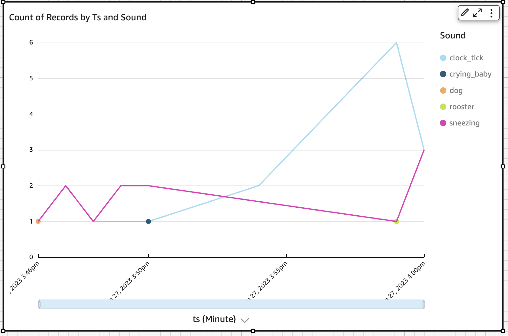

# AWS STM32 ML at Edge Accelerator

This is an AWS STM32 example project that implements MLOps infrastructure using SageMaker pipeline to train and generate an audio classification model that will run on edge devices (stm32u5 series) with OTA updates using Amazon Freertos. Devices are connected to Iot Core and data is collected via mqtt.

## Architecture


## Deployment

The project is built using CDK IaC. So it can be deployed to your AWS account with a single deploy command.

### Pre-requisites

- Ensure your AWS credentials are in place for your Pipeline account (The account that will host the pipeline stack if different)
- Ensure you have [Node.js](https://nodejs.org) and [Docker](https://www.docker.com/products/docker-desktop/) installed
- Create an account in [STM32Cube.AI Developer Cloud](https://stm32ai-cs.st.com/home)
- In your AWS Cloud that will host the ML Stack, go to secrets manager console page:
  - Create a secret called STDEVCLOUD_USERNAME_SECRET and put the username as plain text
  - Create a secret called STDEVCLOUD_PASSWORD_SECRET and put the password as plain text
- Bootstrap your account:
  run the following commands
  ```
  npx cdk bootstrap aws://<ACCOUNT-NUMBER>/<REGION> -- --toolkit-stack-name CDKToolkit-StMicro --qualifier stmicro
  ```

### deploy the CICD Pipeline

1. Fork this repo.
1. Clone your fork locally.
1. Go to [cdk.json](./cdk.json) and put your aws account details for each stack in the `env` field, you could deploy the stacks in the same account or in different accounts
1. You need to set up a connection between the pipeline and your Repo
   1. Follow the steps to create & very the connection [here](https://docs.aws.amazon.com/dtconsole/latest/userguide/connections-create-github.html)
   1. Go to [cdk.json](./cdk.json) and paste your Repo name, branch & connection Arn in the config section.
1. Finally in the root folder, run the following commands
   ```
   npm install
   npm run deploy
   ```
1. This is the only time you need to run commands locally, for any future changes just push new commits to your repo and the pipeline redeploy the new code changes.

### Setup the Device

These steps assume you have the B-U585I-IOT02A

#### Pre-requisites

- Ensure your AWS credentials are in place for your IoT account (The account that will host the IoT stack if different)
- Download and Install [STM32CubeProgrammer](https://www.st.com/en/development-tools/stm32cubeprog.html) to be able to flash device with initial firmware

#### Provision Your Board

To provision your board follow use scripts by following the below steps:

setup your environment

```
sh tools/env_setup.sh
```

then source your environment

```
source .venv/bin/activate
```

In your AWS Console go to the cloudformation page and then click on IoTStack and view the Output tab. Copy and run the `ProvisionScript` replacing the <> with a unique name for your device

the script should look like below

```
python tools/provision.py --interactive  --thing-name <Thing-Name>
```

After you provision the device successfully. Go back to the output tab of the IotStack in cloudformation page. And copy the public key value. and follow below steps:

1. connect to device using `screen /dev/tty.usbmodem103 115200`
1. run this command `pki import key ota_signer_pub`
1. paste the public key you copied. you should a confirmation of key being registered

## Flashing the device

Before we can use over the air (OTA) firmware updates, we need to atlease flash the device with the firmware manually once. Then future changes will be handled by Freertos OTA updates.

After CDK deployment is successfull a binary firmware should have been created in s3 bucket. You can find the name of the bucket in the cloudformation output tab for the iotStack.
please download the the file and downloading and using [STM32CubeProgrammer](https://www.st.com/en/development-tools/stm32cubeprog.html) follow the [steps](https://wiki.stmicroelectronics.cn/stm32mpu/wiki/STM32CubeProgrammer#Flash_programming_principles) to flash the device with the firware.

Once flashed if you are still connected to the device using the command `screen /dev/tty.usbmodem103 115200`, you should see the device starting to log sound class detected from sensors.

## Iot

Our device should be publishing MQTT messages now. If you go to AWS IoT console page and open MQTT test client, type the device name in the filter and subscribe. You will see the messages coming in.

These messages are streamed and stored into AWS Iot Analytics. Which will then be used as a datasource for Quicksight to visualise it.

## Quicksight Dashboard

To visualise your data, we will be using Quicksight. Go to quicksight console page and you will need to sign up to use Quicksight. While going through the steps when you come across the section titled `Allow access and autodiscovery for these resources` make sure you enable `AWS IoT Analytics`. Once you are inside Quicksight, just do the following:

1. Click New Analysis
1. Click New dataset
1. Choose AWS IoT Analytics
1. Select our Analytics dataset and click Create data source
1. Click Visualize
1. Choose the Free-form layout and click Create

you should be able to display a graph as image below.



## Clean up

To remove all resources created by this stack run the following

```
npm run destroy
```

## Security

See [CONTRIBUTING](CONTRIBUTING.md#security-issue-notifications) for more information.

## License

This library is licensed under the MIT-0 License. See the LICENSE file.
